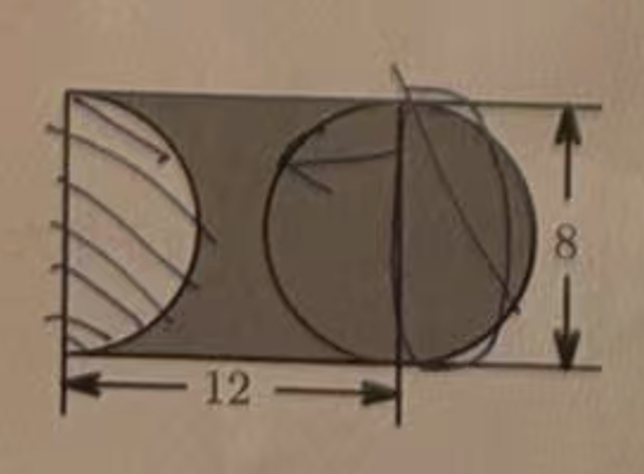
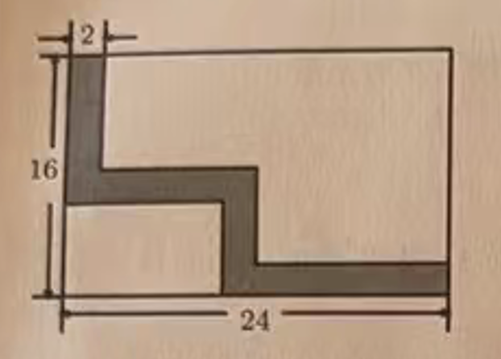
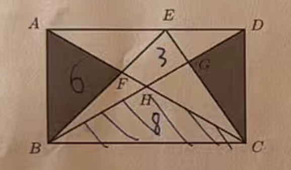
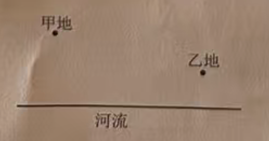
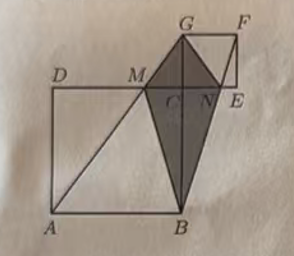
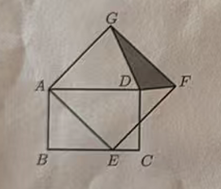
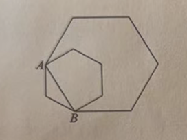
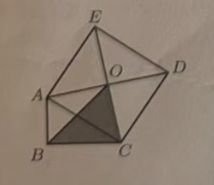

## A 卷（100 分）

### 一、填空（共 10 题，每题 4 分，共 40 分）

1. 将十进制数 34 转化为五进制数为（__________）5。

2. 甲、乙两人在长为 400 米的环形跑道上练习跑步，甲速度为 7.5 米/秒，乙速度为 8.5 米/秒。若甲、乙两人相距 160 米且同时同向出发，则经过 __________ 秒两人第一次相遇。

3. 一个四位数 410A 能被 3 整除，A = __________。

4. 已知六位数 20□279 是 13 的倍数，□ 中的数字是 __________。

5. 有一楼梯共 11 级，每步只能上一级或两级，第 6 级楼梯上有水不能走，要登上第 11 级，共有 __________ 种不同走法。

6. 英文字母 M、Y、N、D 可以看作轴对称图形的有 __________。

7. 黑板上有 7 个数，它们的平均数是 45，小明把其中一个数错看成 32，结果平均数就变成了 41，那么小明看错的数原来是 __________。

8. 计算下图中阴影部分的面积 __________。（单位：米）

   

9. 如图，在一张长 24 厘米、宽 16 厘米的长方形纸片上，剪下一条宽 2 厘米的纸带（阴影部分），那么这条纸带的面积是 __________ 平方厘米。

   

10. 如图，在长方形 ABCD 中，AB = 6 厘米，BC = 8 厘米，四边形 EFHG 的面积是 3 平方厘米，阴影部分的面积和是 __________ 平方厘米。

   

### 二、计算（共 4 小题，每题 4 分，共 16 分）

11. 计算：1.25 × 64 × 0.25。

12. 计算：9.81 × 0.1 + 0.5 × 98.1 + 0.049 × 981。

13. 计算：28 + 208 + 2008 + …… + 20000000008。（最后一个数中间有 9 个 0）

14. 计算：6666666666 × 9999999999。（第一个数由 10 个 6 组成，第二个数由 10 个 9 组成）

### 三、解答题 Ⅰ（共 7 题，15—20 每题 6 分，第 21 题 8 分，共 44 分）

15. 如下图，将军从甲地骑马出发，要到河边让马饮水，然后再回到乙地的马圈，为了使行走的路线最短，应该让马在什么地方饮水？

   

16. 艾迪、微儿两人在 400 米的环形跑道上跑步，艾迪以 300 米/分的速度从起点跑出，1 分钟后，微儿从起点同向跑出。又过了 5 分钟，艾迪追上微儿。

    （1）微儿每分钟跑多少米？

    （2）如果他们的速度保持不变，艾迪需要再过多少分钟才能第二次追上微儿？

17. 如图，正方形 ABCD 的边长为 12，正方形 CEFG 的边长为 5，求阴影部分的面积。

    

18. 如图，四边形 ABCD 和 AEFG 分别是长方形和正方形，已知正方形的边长是 6，三角形 DFG 的面积是 5，长方形 ABCD 的面积是多少？

    

19. 某校男老师的平均年龄是 27 岁，女老师的平均年龄是 32 岁，全体老师的平均年龄是 30 岁，如果男老师比女老师少 13 名，那么该校共有多少名老师？

20. 有一块匀速生长的草场，可供 18 头牛吃 5 天，或可供 16 头牛吃 6 天。那么它可供 12 头牛吃多少天？

21. 5 个同学 A、B、C、D 和 E 互相传球，开始时球在 A 同学手中，在传球 5 次之后球传到 E 手中，如果 B 不喜欢 C，永不会传球给 C 的话，共有多少种传球方法？

## B 卷（50 分）

### 四、解答题 Ⅱ（共 6 题，22—26 每题 8 分，第 27 题 10 分）

22. 已知六位数 35□37□ 既是 5 的倍数又是 11 的倍数，那么这个六位数可能是多少？

23. 如图，连接小正六边形的两个顶点 AB，并以 AB 为边做大正六边形，小正六边形的面积为 12，则整个图形的面积是多少？

    

24. 在一次数学竞赛中，实验小学获奖同学的总平均分为 80 分，其中 8 名获一等奖的同学的平均分为 95 分，2 名获三等奖的同学的平均分为 70 分，获二等奖的同学平均分为 75 分，该校在这次数学竞赛中获奖的同学一共有多少人？

25. 有一个牧场长满草，每天牧草匀速生长，所有牛每天的食草量均相同，已知这个牧场可供 17 头牛吃 30 天，可供 18 头牛吃 24 天，现有牛若干头先在吃草，6 天后，4 头牛死亡，余下的牛吃了两天将草吃完，那么原来有多少头牛？

26. 如图所示，△ABC 中，∠ABC = 90°，AB = 3，BC = 5，以 AC 为一边向 △ABC 外作正方形 ACDE，中心为 O，求 △OBC 的面积。

    

27. 满足下面性质的四位数称为“好数”：它的个位比十位大，十位比百位大，百位比千位大，并且任意相邻两个数字的差都不超过 3，例如 1346、2579 是好数，但 1567 就不是好数。请问：一共有多少个好数？

---

